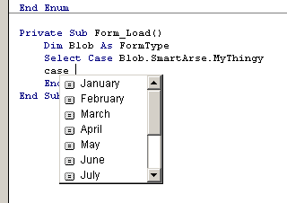



## At last\! A solution to the Select Case Enum problem\! Believe me, you want this code

### Description

The VB IDE's intellisense features really are a godsend. However, a few omissions in its conception are a bit annoying.

For example, when you are doing a Select Case statement with an enum value, you would expect the intellisense to pop up a list box of all the enum values, like it does if you were in an If statement.

That's exactly what this add-in does. It adds this functionality to the IDE. I have seen several ideas of how to get around this limitation, but none that take it this far.

It's not really surprising that no one else has done it. The objects add-ins get to play with to query and manipulate the code conveniently ignore the existence of Enums, totally. So you really have to do it the hard way - parsing the strings until you find the right one. If none is found then it falls back on the typelibs the project references, hoping to find it there.

I'm not going to delve into a detailed description of how the parsing system works, because it's really not that complicated. It's just long, annoying, and with lots of pitfalls to watch out for.

The parsing code itself could be is very useful to anyone wanting to parse VB code, for any reason. Little gems like GetModuleEnums() or GetProcParams() could prove themselves handy in any number of situations.

I'm not saying the code is bug-free, because it almost certainly isn't. It does however work in every circumstance I have tested, and has yet to crash the IDE.

A lot of improvements could be made to this code. Caching the parsing results would dramatically improve search speed, and the parsing algorithms themselves could be vastly accelerated. Still, it works.

Here's a list of exercises left "for the reader" :)

* Improve the parsing algorithms, possibly by using array pointers instead of string manipulation

* Cache results so they don't have to be repeated every time

* Extend the concept to popup a list of labels when the user types "Goto " or "GoSub "

* Implement sorting in the list box [as an option, as it's not always appropriate]

* In the enum pop-up box, check which values have already been checked for in the Select Case statement, and draw them in grey, or strike through, or something.

Anyway, have fun, enjoy the code, and don't forget to send me your comments [and your vote :) ]

If you use any of the code, please let me know [I won't mind, honest, but I'd like to be informed, for my ego's sake if nothing else].

grigri
 
### More Info
 

             |
---                |---
**Submitted On**   |2004-04-14 10:30:04
**By**             |[grigri](https://github.com/Planet-Source-Code/PSCIndex/blob/master/ByAuthor/grigri.md)
**Level**          |Intermediate
**User Rating**    |4.8 (72 globes from 15 users)
**Compatibility**  |VB 6\.0
**Category**       |[Complete Applications](https://github.com/Planet-Source-Code/PSCIndex/blob/master/ByCategory/complete-applications__1-27.md)
**World**          |[Visual Basic](https://github.com/Planet-Source-Code/PSCIndex/blob/master/ByWorld/visual-basic.md)
**Archive File**   |[At\_last\!\_A1733274142004\.zip](https://github.com/Planet-Source-Code/grigri-at-last-a-solution-to-the-select-case-enum-problem-believe-me-you-want-this-code__1-53146/archive/master.zip)

